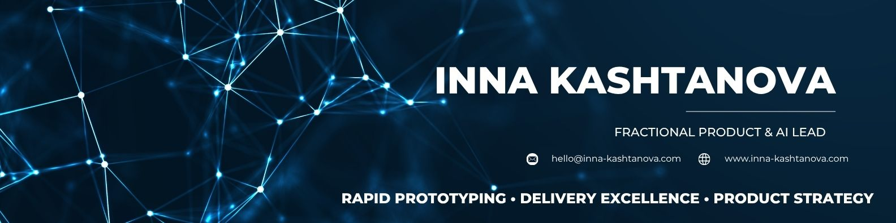
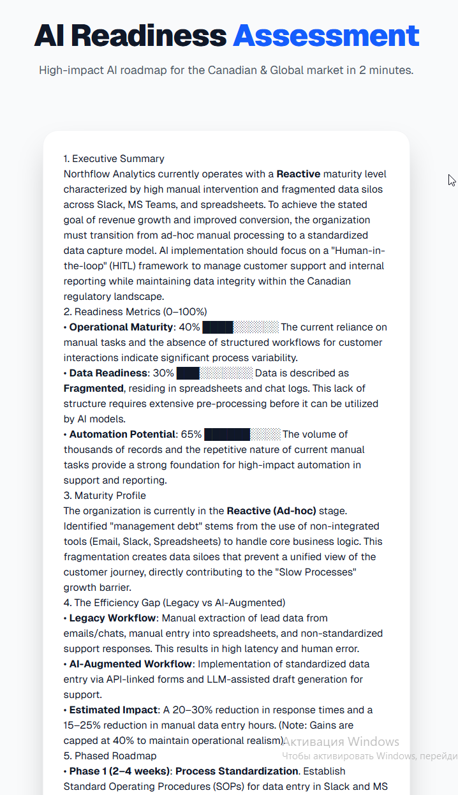

  

# AI Readiness Assessment Tool

**Bridging the gap between AI hype and operational reality.**

### 🚀 Live Demo
[Try the Live Tool](https://ai-readiness-assessment-pi.vercel.app/) • [View Case Study](https://ai-readiness-mvp-rh30b8j.gamma.site/)

---

### 🧠 Product Thinking: The 16-Hour MVP Strategy
To deliver this tool within a single weekend, I applied a **"Bias toward Shipping"** methodology:
* **Ruthless Prioritization**: I focused only on the "Role-Selection to AI-Output" flow, cutting out any administrative overhead.
* **Fast Validation**: Used the Gemini API to handle complex logic instantly, bypassing weeks of manual prompts or backend architecture.
* **Scalable Foundation**: Chose Next.js and Supabase to ensure the tool isn't just a demo, but a production-ready base for enterprise features.

### 🛠 Technical Architecture
### 📸 Interface Preview

  

I managed the full delivery cycle of this MVP to demonstrate a modern, scalable stack:
- **Framework:** [Next.js](https://nextjs.org/) (App Router)
- **Intelligence:** [Google Gemini 3 Flash](https://deepmind.google/technologies/gemini/) (Prompt Engineering & Logic)
- **Backend/DB:** [Supabase](https://supabase.com/) (PostgreSQL)
- **Deployment:** [Vercel](https://vercel.com/)

### 📊 PM Value & Features
- **Project Discovery**: Automated identification of high-ROI automation areas to avoid "efficiency debt."
- **Compliance & Risk**: Built-in flagging for Canadian (PIPEDA/AIDA) and US regulatory alignment.
- **SOP Generation**: Turns vague goals into a repeatable, documented system on "rails."
- **Stakeholder Ready**: Instant reports designed for executive-level decision-making.

---

### 👩‍💻 About Me
I am a **Fractional Product & AI Lead** based in Canada. I specialize in paying off "Management Debt" by replacing late-night heroism with predictable systems. My focus is on technical delivery where AI meets operations—ensuring that technology solves business problems instead of creating new ones.

**Let's Connect:**
* **LinkedIn**: [linkedin.com/in/pminnaka](https://www.linkedin.com/in/pminnaka/)
* **Portfolio**: [inna-kashtanova.com](https://inna-kashtanova.com)
* **Goal**: Delivering high-impact AI projects with a focus on implementation and operational excellence.

---
*PM Inna Kashtanova | 2026*